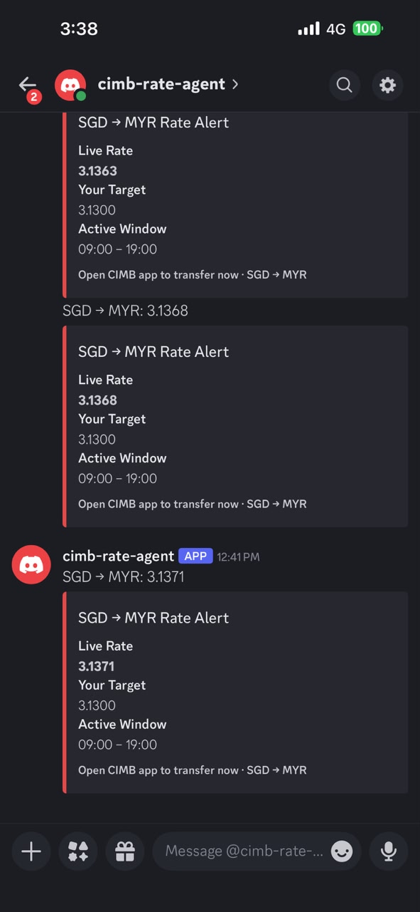

# cimb-rate-sgd-myr

A Python Discord bot agent that monitors CIMB's public SGD->MYR exchange-rate page and sends Discord DM alerts when the rate reaches each user's configured target.

This repository is prepared as a public template/demo project. It does not log in to CIMB, automate the CIMB mobile app, initiate transfers, store banking credentials, or perform any banking action.

## Demo

### Discord Rate Alert



The bot sends a Discord DM when the live CIMB SGD→MYR rate reaches the configured target. The mobile notification preview includes the live rate, for example:

```text
SGD → MYR: 3.1371
```

The Discord embed shows the current live rate, the user's target rate, and the active alert window used for that notification.

### Discord Bot Walkthrough

Demo video: [View/download MP4](docs/assets/discord-bot-demo.mp4)

The demo video shows the self-hosted bot running as a Discord-first interface for checking status and managing per-user alert settings.

## Features

- Monitors CIMB's public SGD->MYR rate page with Playwright.
- Sends Discord DM alerts when a configured target and peak-rate condition are met.
- Supports per-user configuration through Discord slash commands.
- Provides a mobile-friendly `/menu` flow for target rate, alert window, active days, and enable/disable settings.
- Stores per-user config as local JSON files in `config/`.
- Hot-reloads config file changes without restarting the agent.
- Runs continuously on a VM with systemd restart behavior.
- Keeps secrets in `.env` locally and GitHub Actions Secrets for deployment.

## Architecture


Runtime components:

- `agent.py` loads settings, opens the Playwright browser context, reads the live rate, evaluates alert windows, tracks peak rates, and starts the Discord bot.
- `bot.py` defines the Discord slash commands and interactive settings views.
- `config_loader.py` reads, writes, and watches per-user JSON config files.
- `notifier.py` builds and sends Discord DM alert embeds.
- `cimb-agent.service` runs the agent as a systemd service on the VM.

## How It Works

1. The agent opens CIMB's public SGD->MYR rate page.
2. Playwright reads the visible rate from the page at the configured interval.
3. The alert engine checks whether each enabled user is inside their configured active day and active time window.
4. If the current rate is at or above the user's target and higher than the stored peak rate, the bot sends a Discord DM alert.
5. The user's `peak_rate` is updated after a successful alert so repeated notifications are not sent for the same rate level.
6. When the live rate drops below the user's target, `peak_rate` resets to `0.0`.

The service process can run 24/7. Monitoring work is gated by the configured active window and active days.

## Discord Bot UX

Users manage their own alert settings through Discord slash commands:

| Command | Purpose |
| --- | --- |
| `/register` | Create a user config with default settings. |
| `/status` | Show the current live rate and the user's alert config. |
| `/settarget` | Set the target SGD->MYR rate. |
| `/setwindow` | Set the active alert time window in `HH:MM` format. |
| `/setdays` | Set active alert days. |
| `/toggle` | Enable or disable alerts. |
| `/menu` | Open the interactive settings panel. |

The `/menu` panel is designed for phone use. Users can adjust target rate, alert window, active days, and alert state without editing JSON manually.

## Deployment Overview

The intended deployment is a small Linux VM running the agent with systemd:

1. Install Python dependencies from `requirements.txt`.
2. Install Playwright Chromium with `playwright install chromium`.
3. Create a `.env` file on the VM with the Discord token and runtime settings.
4. Keep per-user JSON config files in `config/` on the VM.
5. Install `cimb-agent.service` under systemd.
6. Use GitHub Actions Secrets for SSH deployment credentials.
7. Push to `main` to deploy code changes and restart the service.

The deployment workflow does not require banking credentials. It only deploys code, installs dependencies, copies the service file, reloads systemd, and restarts the agent.

See [docs/deployment.md](docs/deployment.md) for the VM and GitHub Actions guide.

## Security Notes

This project is notification-only:

- It does not log in to CIMB.
- It does not automate the CIMB mobile app.
- It does not perform bank transfers.
- It does not store bank account numbers, passwords, OTPs, or session cookies.
- It only reads CIMB's public SGD->MYR rate page.
- It sends alerts through Discord DMs.

Never commit:

- `.env`
- `config/*.json`
- `state.json`
- Discord bot tokens
- VM IP addresses
- SSH keys
- private key files such as `*.key` or `*.pem`
- raw screenshots or recordings that contain Discord IDs, usernames, server names, tokens, VM details, or personal data

Sanitize demo screenshots before publishing. Use `docs/assets/raw/` only as a local staging folder; it is gitignored.

## Template Usage

To adapt this repository for your own deployment:

1. Fork the repository.
2. Create your own Discord application and bot token.
3. Copy `.env.example` to `.env` and fill in local values.
4. Install dependencies and Playwright Chromium.
5. Register users through Discord with `/register`, or create local JSON files in `config/`.
6. Deploy to your own VM and configure GitHub Actions Secrets for that VM.
7. Replace placeholder demo assets with sanitized screenshots before sharing publicly.

## Requirements

- Python 3.11+
- Git
- Discord bot token
- Playwright and Chromium
- Dependencies listed in `requirements.txt`

## Local Setup

```bash
git clone https://github.com/yourusername/cimb-rate-sgd-myr.git
cd cimb-rate-sgd-myr
python -m venv .venv
source .venv/bin/activate
pip install -r requirements.txt
playwright install chromium
cp .env.example .env
```

Edit `.env` and add your Discord bot token:

```env
DISCORD_BOT_TOKEN=your_bot_token_here
DISCORD_GUILD_ID=your_server_id
SCRAPE_INTERVAL_MS=3000
IDLE_SLEEP_MS=60000
MAX_NULL_STREAK=5
PAGE_RELOAD_INTERVAL_MS=60000
TIMEZONE=Asia/Singapore
CIMB_RATE_URL=https://www.cimbclicks.com.sg/sgd-to-myr
PLAYWRIGHT_USER_DATA_DIR=.playwright
CONFIG_DIR=config
```

Run the agent:

```bash
python agent.py
```

## User Config Example

Users can self-register with `/register`, or you can create a local config file such as `config/user_123456789012345678.json`:

```json
{
  "name": "Demo User",
  "discord_user_id": "123456789012345678",
  "target_rate": 3.1000,
  "active_start": "09:00",
  "active_end": "19:00",
  "active_days": ["mon", "tue", "wed", "thu", "fri"],
  "enabled": true,
  "last_alerted_at": null,
  "peak_rate": 0.0
}
```

Config files are intentionally gitignored because they contain Discord user IDs and personal alert preferences.

## File Structure

```text
cimb-rate-sgd-myr/
|-- agent.py
|-- bot.py
|-- notifier.py
|-- config_loader.py
|-- cimb-agent.service
|-- requirements.txt
|-- .env.example
|-- .github/workflows/deploy.yml
|-- config/
|-- docs/
|   |-- deployment.md
|   `-- assets/
`-- README.md
```

## What Is Not Implemented

- Rate history storage
- Rate prediction or forecasting
- Multiple bank/rate sources
- Web dashboard
- Bank login automation
- CIMB mobile app automation
- Bank transfers
- Telegram, email, or SMS notifications
